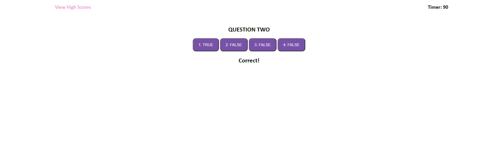

  # QUIZ

  

  ## Description
  
  A front-end webAPI based quiz applet

  ## Table of Contents
  
  * [Installation](#installation)
  * [Usage](#usage)
  * [Contributing](#contributing)
  * [Tests](#tests)
  * [Questions](#questions)
  
  ## Installation
  
  No special instructions for installation, just clone repo or download zip

  ## Usage
  
  Partially unfinished, this application intends to grande a user on their ability to answer code related questions and store scores to a leaderboard. Use of web APIs is demonstrated well within this project. Some struggles with DOM manipulation, cycling over the array of questions, and setting up the localStorage leaderboard. Submitting now due to time crunch. Apologies!

  ## Contributing
  
  No contributors at this time.

  ## Tests
  
  No collaborators at this time.

  ## Questions
  
  Reach out to me at the links below with any questions, comments, or concerns:

  GitHub: [adamlsn](https://github.com/adamlsn) 
  email: [adamlsn@gmail.com](mailto:adamlsn@gmail.com)
  